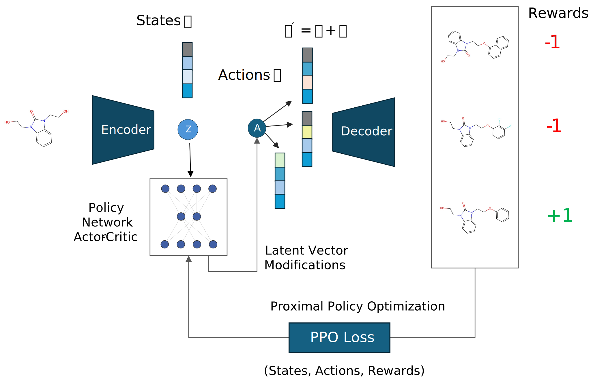

# MolRL

Targeted Molecular Generation With Latent Reinforcement Learning 

Publication: https://www.nature.com/articles/s41598-025-99785-0 

 

## Installation

To install MolRL, you can use the following command:

```bash
git clone https://github.com/Cellarity/MolRL.git
cd MolRL/
pip install .
```


This will download the necessary pretrained models for MolRL but does not include MolMIM 

## MolMIM Installation with BioNemo 
if you want to use `MolRL` with `MolMIM` please refer to the BioNemo [documentation](https://docs.nvidia.com/bionemo-framework/latest/user-guide/getting-started/initialization-guide/) for using MolMIM on a BioNemo container 

## Usage

1. [VAE cyclical annealing training](notebooks/vae_training.ipynb)
2. [Basic Usage With VAE](notebooks/example_usage.ipynb)
3. [Basic Usage With MolMIM](notebooks/example_usage_bionemo.ipynb)
